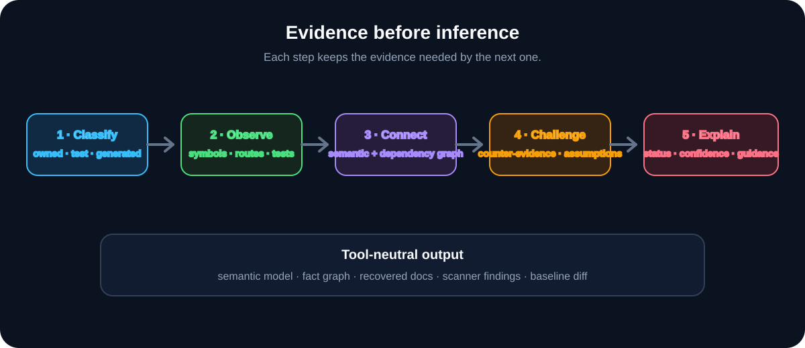
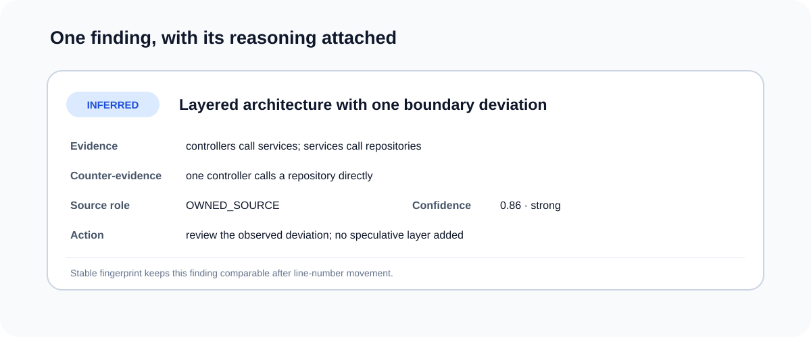

<p align="center">🔎</p>

<h1 align="center">ASES</h1>

<p align="center">Architecture &amp; Software Evidence Scanner — ricostruire ciò che un codebase fa davvero prima di suggerire cosa dovrebbe diventare.</p>

<p align="center"><a href="README.md">English</a> · <b>Italiano</b></p>



## Perché esiste

Molti strumenti di analisi architetturale partono dalla fine: riconoscono un nome, associano un pattern e producono subito una raccomandazione. Su un progetto esistente questo significa diagrammi sicuri di codice generato, Factory trovate in costruttori usati una volta e refactoring suggeriti su JavaScript vendorizzato.

ASES rende esplicito l'ordine opposto: classifica la fonte, raccoglie fatti, conserva la contro-evidenza e soltanto dopo inferisce. Un finding è utile solo se chi lo legge può capire da dove arriva, quanto è forte e cosa potrebbe smentirlo.

Lo scanner analizza progetti Java, Python, TypeScript e frontend. Ricostruisce componenti, dipendenze, route, test, persistenza e confini architetturali osservabili; esporta documentazione leggibile e un modello semantico indipendente dal consumer. Lantern può consumarne l'output, ma il motore non dipende da Lantern.

## Un output spiegabile

Ogni affermazione ha uno stato epistemico:

- `OBSERVED` per l'evidenza diretta;
- `INFERRED` per una conclusione sostenuta da più osservazioni;
- `OPPORTUNITY` per un cambiamento giustificato da uno smell concreto;
- `HINT` per un segnale debole e non direttamente azionabile;
- `UNKNOWN` o `CONTRADICTED` quando l'evidenza manca o confligge;
- `SUPPRESSED` per un finding accettato che deve restare verificabile.

Fingerprint stabili permettono di distinguere finding `NEW`, `RESOLVED`, `CHANGED` e `UNCHANGED` anche se cambiano le righe. Contro-evidenza, assunzioni, ruolo della fonte e copertura dell'analisi restano accanto al finding.



## Prima l'igiene delle fonti

Ogni file viene classificato come sorgente proprietaria, test, generato, vendorizzato, tooling, documentazione o artefatto di build. Report generati, Maven wrapper, librerie minificate, JaCoCo e Javadoc possono comparire nell'inventario, ma non possono definire l'architettura dell'applicazione.

La regola nasce da benchmark su repository reali: uno ha fatto emergere il rumore dei file generati e di terze parti; un altro ha mostrato la necessità di riconoscere in modo conservativo DAO/Repository, `*ServiceImpl`, architettura a livelli e un vero Adapter verso API esterne. Le regressioni restano come fixture eseguibili.

## Analisi supportate

- inventario del repository ed entry point;
- componenti, controller, service, repository/DAO e modelli;
- route, comportamenti, test, persistenza e dipendenze;
- evidenza di Layered Architecture e MVC;
- pattern applicativi e di design separati per livello;
- conformità ed erosione rispetto all'architettura prima osservata;
- componenti frontend, layer di stato/API e contratti frontend ↔ backend;
- baseline, soppressioni e pulizia sicura degli output.

ASES non impone un'architettura target e non trasforma ogni anomalia in una vulnerabilità. Esporta evidenze che strumenti di sicurezza, documentazione o manutenzione possono interpretare nel proprio contesto.

## Installazione e uso

Serve Python 3.11 o successivo.

```sh
cd runtime
python -m pip install -e ".[test]"
python -m pytest -q

ases scan https://github.com/OWNER/REPOSITORY
```

```sh
ases scan https://github.com/OWNER/REPOSITORY --baseline path/to/previous.ases
ases diff previous.ases current.ases
```

L'output principale comprende `semantic-model.yaml`, `fact-graph.json`, `consumer-context.json`, `scanner-findings.json`, report di qualità/validazione e documentazione ricostruita. `scanner-findings.json` è il feed stabile per i consumer.

## Stato

ASES è uno scanner indipendente in sviluppo attivo. La versione 1.7 ha aggiunto classificazione delle fonti e analisi frontend/cross-boundary. La validazione continua su altri repository reali, privilegiando la precisione rispetto al numero di finding. Zero opportunità speculative è un risultato valido.

## Licenza

Copyright © 2026 Ferdinando Gregorio Fernandez. Tutti i diritti riservati. Il codice è visibile per valutazione professionale; riuso, redistribuzione e opere derivate non sono consentiti. Vedi [LICENSE](LICENSE).
